# Lecture 1: Jan17 2024

## Basic of image
- Every pixel of an image show the intensity of image, RBG
- Every image has Height Width or depth.
- 3 diffent color map supperimpose to show the color image.

- each point is called pixel and each pixel has 3 color(RBG)
- every color image are in metrix(3x3x3)
- every color is made up of RGB intensity 

- higher the pixel better the image
- image has structure data, you will never found missing value, you will never find string value here, it has better structure and range is between 0 to 255.

## How our brain understand this is tree, sun or river?
> Because of the cluster of the yellow and pixel location of the sun

## what is the information in an image:
> pixel density or veriation of pixel density at different location in an image. 

## Why ANN cannot work for images?
 - We take an image, Flatten it and pass it to neural network. but it won't work, suppose we have an image(object sun, river, tree).
 - new pixel related to tree should combine in seperate manner, pixel related to river should combine in seperate manner and pixel related to sun should combine in a different manner.
 - we can not combine everything and pass it to neural network.
 - In mnist Handwritten dataset we can apply ANN because everything is black except the digit.

## convaluation process
 - it is a feature extraction process, 
## Concept of keranl
 - we want a machanism where i can extract the features at local level, that is where a concept of windows or kernal comes in.
 - A keranl is basically a metrix of certain weight much lower dimension then the image, let image maybe 100x100 and kernal will be 3x3.
 - A keranl is weight metrics, kernal will get supperimpose on an image, image have some value the keranl have some value.
 - we apply .dot product will happen, and pass it to activation and a neuron is generated.

 

# Edge Detection
### Q. Why we are using Edge Detection?
1. Image processing algorithms take a long time to process the data because of the large images and the amount of information available in it.
1. it is necessary to reduce the amount of information that the algorithm should focus on. Sometimes this could be done only by passing the edges of the image.
1. applying an edge detection algorithm to an image may **significantly reduce the amount of data to be processed** and may therefore filter out information that may be regarded as less relevant while preserving the important structural properties of an image.
1. reduce information form the image. example, a boy holding a football.
1. Reduce unnecessary information in the image while preserving the structure of the image.
1. Extract important features of an image such as corners, lines, and curves.
1. Edges provide strong visual clues that can help the recognition process. 

### Q. What is Edge Detection?
- edge detection is the process of detecting the edges in an image.

### Q. How indicate the boundaries of objects and surface markings?
- Discontinuities in depth, surface orientation, scene illumination variations, and material properties changes lead to discontinuities in image brightness. We get the set of curves that indicate the boundaries of objects and surface markings, and curves that correspond to discontinuities in surface orientation.

### Q. what are multiple approaches for edge detection.
- Traditional approach
- conventional approach: We use filter-based approaches such as Sobel and Prewitt filters
- Deep learning-based approach

#### let us discuss one of the most popular edge detection algorithms – The canny edge detector, and compare it with Sobel and Prewitt.
## Canny Edge Detector
The Canny Edge Detection algorithm is a widely used edge detection algorithm in today’s image processing applications. It works in multiple stages as shown in fig

The input image is `smoothened`, `Sobel filter is applied to detect the edges of the image`. Then we apply `non-max suppression` where the local maximum pixels in the gradient direction are retained, and the rest are suppressed. We `apply thresholding` to remove pixels below a certain threshold and retain the pixels above a certain threshold to remove edges that could be formed due to noise. Later we apply `hysteresis` tracking to make a pixel strong if any of the 8 neighboring pixels are strong.

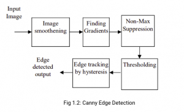

Now, we will discuss each step in detail.

There are 5 steps involved in Canny edge detection, as shown in fig above. We will be using the following image for illustration.

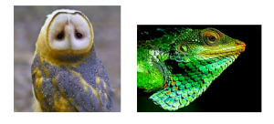

### 1. Image Smoothening
**def**: *Image smoothing, also known as blurring, is a common technique used in image processing to reduce noise and detail, resulting in a smoother appearance.*

**How**: *There are various methods to achieve image smoothing, but one of the most common techniques is using a convolution operation with a Gaussian kernel.*

**Why**: It's called "Gaussian" because its values are determined by the Gaussian function. The Gaussian function is a continuous probability distribution that is symmetric around its mean value, creating a bell-shaped curve.

```python
import cv2

# Read the image
image = cv2.imread('input_image.jpg')

# Apply Gaussian blur
smoothed_image = cv2.GaussianBlur(image, (kernel_size, kernel_size), sigmaX)

# Display the original and smoothed images
cv2.imshow('Original Image', image)
cv2.imshow('Smoothed Image', smoothed_image)
cv2.waitKey(0)
cv2.destroyAllWindows()
```
`kernel_size`: determines the size of the Gaussian kernel. Larger values result in stronger smoothing. <br>
`sigmaX`: sigmaX is the standard deviation of the Gaussian kernel. Higher values increase the blurring effect.
```python
from PIL import Image, ImageFilter

# Open the image
image = Image.open("input_image.jpg")

# Apply Gaussian blur
smoothed_image = image.filter(ImageFilter.GaussianBlur(radius))

# Display the original and smoothed images
image.show()
smoothed_image.show()
```
`radius`: redius is the radius of the Gaussian blur filter. Higher values produce more smoothing.

In this step, we convert the image to grayscale as edge detection does not dependent on colors. Then we remove the noise in the image with a Gaussian filter as edge detection is prone to noise.
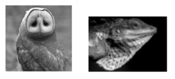

### 2. Finding Intensity Gradients of the Image
We then apply the Sobel kernel in horizontal and vertical directions to get the first derivative in the horizontal direction (Gx) and vertical direction (Gy) on the smoothened image. We then calculate the edge gradient(G) and Angle(θ) as given below,

    Edge_Gradient(G) = √(Gx2+Gy2)

    Angle(θ)=tan-1(Gy/Gx)

We know that the gradient direction is perpendicular to the edge. We round the angle to one of four angles representing vertical, horizontal, and two diagonal directions. <br>
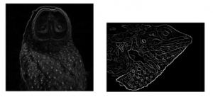

### 3. Non-Max Suppression
Now we remove all the unwanted pixels which may not constitute the edge. For this, every pixel is checked in the direction of the gradient if it is a local maximum in its neighbourhood. If it is a local maximum, it is considered for the next stage, otherwise, it is darkened with 0. This will give a thin line in the output image.
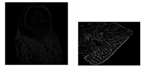

### 4. Double Threshold
Pixels due to noise and color variation would persist in the image. So, to remove this, we get two thresholds from the user, lowerVal and upperVal. We filter out edge pixels with a weak gradient(lowerVal) value and preserve edge pixels with a high gradient value(upperVal). Edges with an intensity gradient more than upperVal are sure to edge, and those below lowerVal are sure to be non-edges, so discarded. The pixels that have pixel value lesser than the upperVal and greater than the lowerVal are considered part of the edge if it is connected to a “sure-edge”. Otherwise, they are also discarded.

### 5. Edge Tracking by Hysteresis
A pixel is made as a strong pixel if either of the 8 pixels around it is strong(pixel value=255) else it is made as 0. <br>
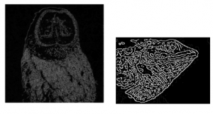 <br>
Now, we will explore the deep learning-based approaches for edge detection. But why do we need to go for the Deep Learning based edge detection algorithms in the first place? Canny edge detection focuses only on local changes, and it does not understand the image’s semantics, i.e., the content. Hence, Deep Learning based algorithms are proposed to solve these problems. We will discuss it in detail now.

But before we dive into the math of Deep learning, let us first try to implement the canny edge detector and the deep learning-based model(HED) in OpenCV.

### Implementation-Canny Edge detection
```python
import cv2 
from skimage.metrics import mean_squared_error,peak_signal_noise_ratio,structural_similarity
import matplotlib.pyplot as plt

img_path = 'starfish.png'
#Reading the image
image = cv2.imread(img_path)

(H, W) = image.shape[:2]
# convert the image to grayscale
gray = cv2.cvtColor(image, cv2.COLOR_BGR2GRAY)
# blur the image
blurred = cv2.GaussianBlur(gray, (5, 5), 0)
# Perform the canny operator
canny = cv2.Canny(blurred, 30, 150)

fig,ax =  plt.subplots(1,2,figsize=(18, 18))
ax[0].imshow(gray,cmap='gray')
ax[1].imshow(canny,cmap='gray')
ax[0].axis('off')
ax[1].axis('off')
```
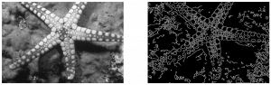
### 1. Edge Filter(Vertical edge detector)
 
 - left size - white region, middle - dark region, right side - darker region
 - when there is same pixel then there is not edge, if they have differnt pixel then it is edge.
 - diffence in the pixel on right hand side and left hand size.
 - when we have this kernal and convalute to the image it mean we are search for edge in that image.
 - **Now question is that how to make cat detector, or circle detection, we do so by learning the weight**

## is it possible to find a car, or a tree from single keranl?
 - No, we need more then one keranl to find the car from the image.
 - We make a learnable kernal and convolute to an imaga and create the feature map.
 - if we have 100 of kernal then it create 100 of feature map.


## Feature Map
- Different Kernel would have learn different features from the image and presented it in the feature maps
- so basically i took the image of the sun, tree, and car, and then using the kernels i learnt different featueres of the sun, tree and car and presented them in feature maps.
- neural network is basically going to learn the weights of the kernels.

- **Dot product happen 3 channel of color with kernal**

## what is information in an image?
- Varision in the pixel intensity is the inforamtion of an image.
- certain pixel are club together or present together that form an object.

## what happend when we flatten an image?
- when we flatten the image complelty and crate the 1 dimenstitional vector that vector, that vector the problem is that we loos locational or speical corelational.

## Feature Extraction
- if we do dot product it will extract feature.
- suppose if my kernal contain plus sign if it do the dot product, we will get higher value where the plus sign is avalable else lower value at feature map.

## Important point related to kernal
 - 1x1 is very small kernal it can not detect anything
 - 2x2 is do not follow symetric
 - 3x3 follow synmetic that is why we are taking smalles kernal as 3x3.

## if we have large size kernal then what is the issue?
 - There is chances that sun and bird both can capture by single neuron.
 - risk of including other object in that location.

## if large kernal is issue then small kernal may also have problem?
 - for example, one 3x3 kernal can not be detect whole sun.
 - using the 3x3 kernal may not capture our sun properly.
 - there is not problem because one kernal create one feature map which is pass by one neuron.
 - one neuron can learn left part of sun, one neuron learn right part of sun, one neuron learn bottom part of neuron. so there is no issue. but if we take larger kernal size then there is an issue that both sun and tree capture by single neuron, and that neuron get confuse which output to product sun or tree.
 - so small size kernal is not has big risk.
 - small size kernal is less infomation but there is not risk of capturing nebouring object.

## where we are using the large size kernal. 
 - yet to answer

## why kernal has to be symetric not square
 - yet to answer

## What is the dimension of feature map
 - if you have 100x100 pixel image(RGB) and has 100 of 3x3 kernal, the output of feature map. we will get with strive=1 is find out using the formula
 - H' = [(H-f)s]+1
 - W' = [(W-f)s]+1
 - depth = no of filter we have applied


Sure, let's apply the formula to find the size of the feature map:

Given:
- Input Size (W_in) = 100 (width), 100 (height)
- Kernel Size (K) = 3 (width), 3 (height)
- Stride (S) = 1

Using the formula:

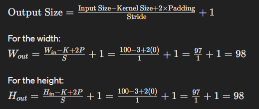

So, the output feature map size will be \(98 \times 98\) for each kernel. Since there are 100 kernels, you'll end up with 100 feature maps of size \(98 \times 98\).

## stride
Stride in convolutional neural networks (CNNs) refers to the number of pixels by which the filter (kernel) is moved across the input image. A stride of 1 means the filter moves one pixel at a time, while a stride of 2 means it moves two pixels at a time, and so on. Changing the stride affects the size of the output feature map. A larger stride reduces the size of the output feature map, while a smaller stride preserves more spatial information but increases computational cost.

## now, how many parameter the above configuration has.
### Calculation of Parameters in Convolutional Layer

## Introduction
In convolutional neural networks (CNNs), the number of parameters in a convolutional layer is crucial for determining the model's size and complexity. calculation of the total parameters for a above configuration.

## Calculation
```
For each 3x3 kernel:
- Number of parameters = (3 input channels) * (3x3 kernel size) + 1 (bias term)

So, for each kernel:
Number of parameters per kernel = (3 * 3 * 3) + 1 = 28

Then, for 100 kernels:
Total parameters = Number of parameters per kernel * Number of kernels
                  = 28 * 100
                  = 2800

Therefore, the given configuration has a total of 2800 parameters.
```
This information is essential for understanding the computational complexity and memory requirements of the convolutional layer in a CNN.
 - Number of learnable parameter is independent of size of image.
 - it is depended upon the size of kernal

 

 ## Max Pool
  - max pool is also a kind of convalution operation only with some filter size, this operation took max out of it. 
  - remove unwanted neuron that is comes up during convolution.
  - this is a clean up process, we are saying just give me max out of it.
  - when we train a kernal which can learn only tree(suppose) object from an image, there is high chances that that kernal takes some part of sun(suppose) so for that we need some clean up process, this clean up process is called max pooling.
  - suppose we have 28x28x3 image and we apply dot product with 3x3x100 kernal it will generate 26x26x100 feature map.
  - we already know that dring colvalution it take the some part of neabouring object so this max pooling remove that part and takes the max out of it.
  - 
  - after this i would have clean feature map.
  - __Max pool don't have the weight so what it is doing in backpropagation, it convert back from 2x2 matrix to original 4x4 matrix__
  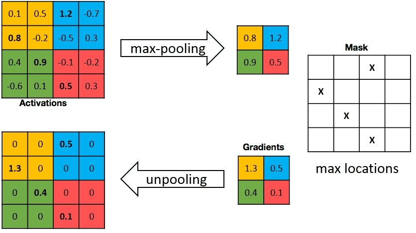
  - for forward propation dimenality reduction backword propagation dimentaionly expension.

  image --> Conv --> Feature map --> max pooling --> reduct feature map --> flatten --> pass it to dence -- > you get y hat --> last find the loss

## Global Average Pooling
 - give the flatten vector

## Convolutional Neural Networks
 - Apply Convalution to extract feature and max pooling to clean up feature, repect twice thrise. max pooling get raid of unnessary neuron.
 - will do the **global max** at the end, which will give me most important feature of the each feature map.
 - using the global max, each map talk about the most import part of the tree in the feature map.
 - then we pass it to dense layer to predict the tree, that is what convoltution articture looks like.
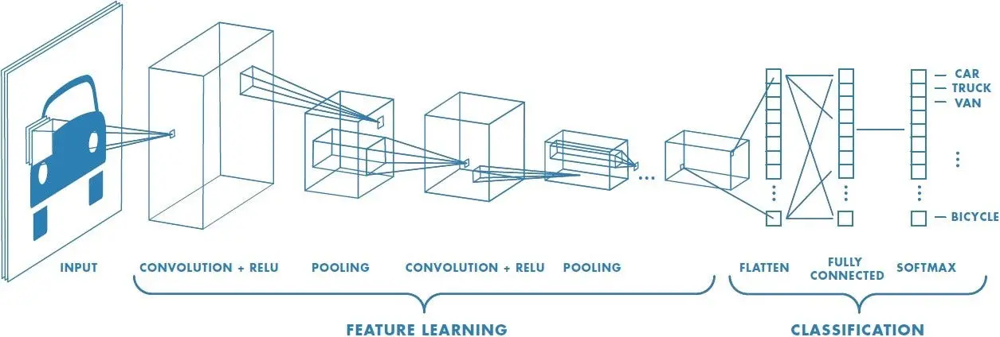

## Flatten 
 - after the max pooling, we having much smaller feature map(4x4 suppose).
 - one thing we can do we average it out, or 
 - flatten the complete feature map beacuse all the other feature is already eliminiated, we left with our desire output(tree for example)

## Resizing
  - our aim is to reduct our image to 28x28 if the image size is 100x300, then how can you choose, crop it to 28x28, are you going to crop or zoom.
  - so for that we are using something called Bilinear Interpolation.
  - 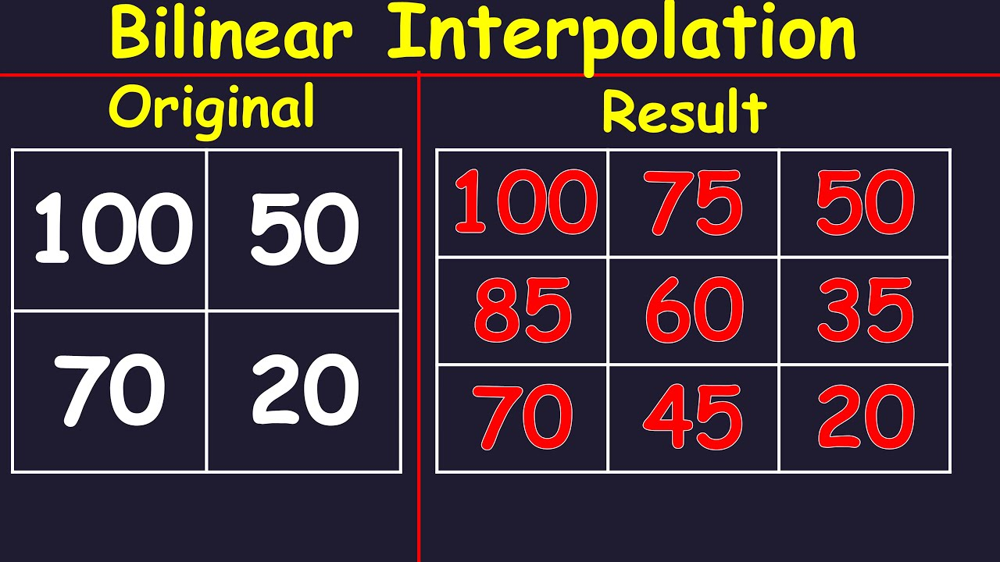

## Create a Squential Pipeline
  ```python
  def preprocess(train_data, val_data, test_data, target_height=128, target_width=128):

    # Data Processing Stage with resizing and rescaling operations
    data_preprocess = keras.Sequential(
        name="data_preprocess",
        layers=[
            layers.Resizing(target_height, target_width),
            layers.Rescaling(1.0/255),
        ]
    )

    # Perform Data Processing on the train, val, test dataset
    train_ds = train_data.map(lambda x, y: (data_preprocess(x), y), num_parallel_calls=tf.data.AUTOTUNE)
    val_ds = val_data.map(lambda x, y: (data_preprocess(x), y), num_parallel_calls=tf.data.AUTOTUNE)
    test_ds = test_data.map(lambda x, y: (data_preprocess(x), y), num_parallel_calls=tf.data.AUTOTUNE)

    return train_ds, val_ds, test_ds
  train_ds, val_ds, test_ds = preprocess(train_data, val_data, test_data)
  ```

## Model Architecture
```python
def baseline(height=128, width=128):
    num_classes = 10
    hidden_size = 256

    model = keras.Sequential(
        name="model_cnn",
        layers=[
            layers.Conv2D(filters=16, kernel_size=3, padding="same", activation='relu', input_shape=(height, width, 3)),
            layers.MaxPooling2D(), #by default pool size=(2x2) and stride size=2
            layers.Flatten(),
            layers.Dense(units=hidden_size, activation='relu'),
            layers.Dense(units=num_classes, activation='softmax')
        ]
    )
    return model
model = baseline()
model.summary()
```

```python
Model: "model_cnn"
_________________________________________________________________
 Layer (type)                Output Shape              Param #   
=================================================================
 conv2d (Conv2D)               (None, 128, 128, 16)     448       
                                                                 
 max_pooling2d (MaxPooling2D)  (None, 64, 64, 16)        0          
                                                                                                        
 flatten (Flatten)             (None, 65536)             0         
                                                                 
 dense (Dense)                 (None, 256)              16777472  
                                                                 
 dense_1 (Dense)               (None, 10)               2570      
                                                                 
=================================================================
Total params: 16,780,490
Trainable params: 16,780,490
Non-trainable params: 0
_________________________________________________________________
 - H' = [(H-f)s]+1
 - W' = [(W-f)s]+1
 - depth = no of filter we have applied
```

## Overfitting(Data Augmentation)
 - to remove the overfitting we are using Data Argmentation
 - left, right, up size down etc rolated, zoom image, scaled down image also a cat, crop image of a cat is cat.
 - to create our model much robust, because it see more variation of the training data.
 - to show the variation of image.

## Image Augmentation
  + what is Augmentation? 
      - using this we are making our model more robust
      - Color, Increse the sharpness
      - reduce the light
      - rotate the image
      - zoom the image
      - shift the image here and there
      - crop the image
    these are real life image. we need some veriation of the image to train, we can not say we need only those image where line is at the center of the image.
  + camera angle might be different there may be differnt angle, there might be zoom-In or Out image.
  + we have to make a model in such a way that if i have a cat classifer if it sleeping my model should predict it is a cat, if it is running my model should predict it is cat and like so on. if my cat oocuping 90% of image then also my model should predict it is a cat.
  + so during the training process, can i rotate the image, can i zoom in the image, can i do some random transformation to the image while sending to the training pipeline. this is what called data augmentation.
  + *def*- during the training process the model not only learning the images but also learing the variation of the image. for exmple variation of zoom in cat, variation of rotation cat etc.
  + Augmentation is a technique to artificially increase the amount of data by generating new data points from existing data.

### How can we increase the data from existing data?
  > By making Minor changes such as flips, translations,brigntness,coloring, rotations etc.

### How does it help with training?
  > This leads to greater diversity of data samples being seen by the network hence decreasing the likelihood of overfitting the model on the training dataset.
  >Also it helps in reducing some of the spurious characteristics of the dataset.

### What different sort of Augmentation strategies we can apply?
  + Some most common data augmentations are:
      padding
      random rotating
      re-scaling,
      vertical and horizontal flipping
      translation ( image is moved along X, Y direction)
      cropping
      zooming
      darkening & brightening/color modification
      grayscaling
      changing contrast
      adding noise
      random erasing
      sharpness: image + lambda(image-cv2.gaussianBlur(image))
      contrast: low pixel < 20 to 0, higher then > 200 to 255
      brightness: (all pixel + 10)

### data generator:
  + it is kind of pipeline where, which is directly connected to the image folder, and from there we can acturally send images to the model.
  + it is like a tap, when you open the tap it will give image if you close the tap is will stop giving you images.
  + suppose it have 40000 image, after sending this 40000 images you can futher dement the image from this pipeline.
  + what is the advantage: if you have 40000 good HD qualtiy image in you hardisk, and you wanted to use to train the model, if you read the entire 40000 hd image, you RAM got out of memory.
  + to prevident this, we use data generator, what it do it open the tap and take 512 image train the model flush the image, again it take next 512 image train the model flush down the image, and the things go on. that is the benifit of data generator. by the way 512 image is batch size.
  + Augementation can be a part of data generator or the model pipeline, depend upon the architecture of the model, previouly it was a part of data generator now, it is the part of model pipeline.
  + keras has also argumentation layer in the sequential model
  + this argumentation apply some random(crop, resize, brightness etc) thing to the image and pass it the model to train the model.
  + you will never run out of image, because of whenever you need image, you just turn on the tap and it will give the some image and you can argument the image and you have enoght image to train your model.
  + theoryticaly you can not run out of images, because of image argumentation layer.

### why can't you do argumentation in tabular data?
  + if we do some row change then whole regress will change or the class/label change. that is why we can not argument the tabular data.
  + oversampling is duplicate data but this is argumented data.
  + but in the case of image, if we zoom in, crop, increae or decrese the image, it will alway repersent the cat.

### Causing in using image augumenation.
  + we can not drastically use of augumenation, if you do to much zooming it may put the object(cat) out of image.

## How do we apply augmentation in tensorflow / keras?
  There are many ways to apply augmentation in Tensorflow/Keras, few of them are discussed here:

  1. using the Keras Preprocessing Layers, just like preprocessing functions like resizing and rescaling, keras also provides data augmentation layers like tf.keras.layers.RandomFlip, tf.keras.layers.RandomRotation, etc. These can be used in a similar way as we used the preprocessing functions.
  1. using tf.image methods like tf.image.stateless_random_flip_up_down, tf.image.stateless_random_brightness
  1. using Keras ImageDataGenerator API - It provides quick, out-of-the-box suite of augmentation techniques like standardization, rotation, shifts, flips, brightness change, and many more.

## what is padding?
  + padding help to start the corner left of the image, and does help in not lossing the information.
  + using padding we can retain the size of feature map as original image.
  + padding='same','valid' in this case Height and weight will be same as orginal image.
  + with padding (padding='same')
    - H' = [ (H+2P-f)/s]+1
  + without padding (padding='valid')
    - H' = [ (H-f)/s]+1

### when to use padding?
  + do some research,
  + advantege of using it.
  + when to use or not to use.

## Backpropagation in CNN
  + adjest the weight and biases
  + backpropagate from right to left
  + unpooling maintain the same dimension


# Introduction to Transfer Learning
1. Transfer learning 
  - ML models are not exchangeable, for example churn of google model can not make sence to Amazon or meta.
  - Example of Transfer learning, suppose i have train my model with 5000 images but my friend has train his model more then 50k image data. so i can call my friend and ask my friend to give me their model for my prediciton. this is good example of transfer learning.
  - Transfer learning is duable in image data.
  - z-score of age of USA population is differnt then the Z-score of age of indian populaution.
  - another example, in my laptop value of pixel (255,66,54) is as through out all the laptop, there is unifomality in image data.
  - we can fine tune and train the model of our interest. 

understand the Tranfer learning (with VGG arthicecture) 
 + In the concept of tranfer learning, you used a pre-train model in which in all the layers the weights and bias are fixed, but on top of that you apply your own dense layer and then you do classification. 
 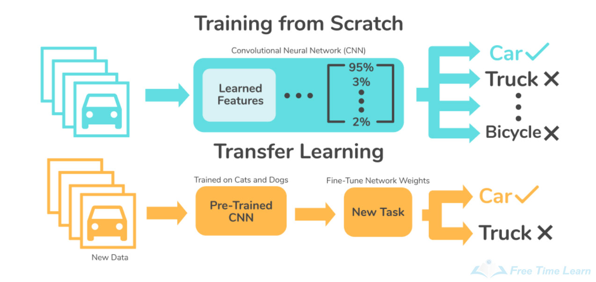

### VGGNet(Standard CNN Architecture)
  - Very deep Convolutional networks for large-scale image recongnition.
```python
pretrained_model = tf.keras.applications.VGG16(weights='imagenet', include_top=False, input_shape=[224,224, 3])
# "Get the first few blocks of pretrained model and freeze them"
#1. break this pretrained model into two halves. first half is what you will freeze, 2nd half you will keep as it is
#2. sequential api (1st half, 2nd half, flatten, dense)
pretrained_model.trainable=False
vgg16_model = tf.keras.Sequential([
    pretrained_model,
    tf.keras.layers.Flatten(),
    tf.keras.layers.Dense(10, activation='softmax')
])

import functools
top5_acc = functools.partial(tf.keras.metrics.SparseTopKCategoricalAccuracy())

vgg16_model.compile(
    optimizer='adam',
    loss = 'sparse_categorical_crossentropy',
    metrics=['accuracy']
)

history = vgg16_model.fit(train_ds, epochs=5, validation_data=val_ds)
```

### AlexNet(Standard CNN Architecture)
  - big filter lower depth and VGGNet smaller filter bigger depth.


## Image Similarity: Understand Image Embeddings
  - Given an image we can pass it to conv max pooling, conv max pooling multiple itmes.
  - which then i will do gobal averge pooling or i can do flatten to get a 1-dimensional vector
  - then pass it to dence layer to predict cat, dog or +ve, -ve whatever.
  - and based on that your backpropagation happen and your weights get updated.

### cosine similarity of two vector
  - if the cosine similarity of two vector is high then we can say those 2 vector are similar
  ### Cosine Similarity Formula
Cosine similarity is a measure of similarity between two non-zero vectors of an inner product space. It measures the cosine of the angle between them. The formula for computing cosine similarity between two vectors \( \mathbf{a} \) and \( \mathbf{b} \) is:

\[
\text{similarity} = \frac{{\mathbf{a} \cdot \mathbf{b}}}{{\|\mathbf{a}\| \cdot \|\mathbf{b}\|}}
\]

Where:
- \( \mathbf{a} \cdot \mathbf{b} \) is the dot product of vectors \( \mathbf{a} \) and \( \mathbf{b} \)
- \( \|\mathbf{a}\| \) is the Euclidean norm (magnitude) of vector \( \mathbf{a} \)
- \( \|\mathbf{b}\| \) is the Euclidean norm (magnitude) of vector \( \mathbf{b} \)

In Python, using NumPy, you could compute the cosine similarity of two vectors as follows:

```python
import numpy as np

def cosine_similarity(a, b):
    dot_product = np.dot(a, b)
    norm_a = np.linalg.norm(a)
    norm_b = np.linalg.norm(b)
    similarity = dot_product / (norm_a * norm_b)
    return similarity

# Example usage:
vector1 = [1, 2, 3]
vector2 = [4, 5, 6]

similarity = cosine_similarity(vector1, vector2)
print("Cosine Similarity:", similarity)

```
### Image Similarity using Frobenius Norm
- differnce between element wise euclden distance.
In image processing and computer vision tasks, measuring the similarity or difference between images is a fundamental problem. One way to quantify the difference between two images is by using the Frobenius norm.

#### Frobenius Norm

The Frobenius norm of a matrix is a generalization of the Euclidean norm for vectors. For an \(m \times n\) matrix \(A\), the Frobenius norm is defined as:

\[
\|A\|_F = \sqrt{\sum_{i=1}^{m} \sum_{j=1}^{n} |a_{ij}|^2}
\]

Where \(a_{ij}\) are the elements of matrix \(A\).

#### Image Similarity using Frobenius Norm

Given two images represented as matrices \(A\) and \(B\), their Frobenius norm difference can be calculated as:

\[
\text{Frobenius\_norm\_difference} = \| A - B \|_F
\]

This measure allows us to quantify the difference between two images based on their pixel values. Lower Frobenius norm differences indicate greater simi


### Process of Image similarity
 - image1(cat) --> (conv, max pooling)xN --> feature map --> Flatten --> Vector 1
 - image2(cat) --> (conv, max pooling)xN --> feature map --> Flatten --> Vector 2
    - now find cosine similarity between (vector 1 and vector 2) if the value is high then both image is same else different image.

  - __Q. Why can't we directly find the cosine similarity between 2 images, since images are already in vector format, why to go to the conv, max pooling layer.__
  - ans: Following ans can be consider
    1. After Convoluation dimension will be reduced
    1. Frobenius Norm - differnce between element wise eucleaden distance; we will not get any kind of similarity in this case. becz in birds pixel we are find frobenious norm with sun pixel, with sun pixel we are find frobenious norm with car pixel etc. not frobenius norm will not work here. 

#### How image backgroud remover works?
  - take the image, find the object inside the image, extract the object make that object as forground and make everything else as backgroud.

#### Autoencoder used in Segmentation

### Embedding
 - __def__ = Embedding are 1 Dimensional __learnt representation__ of a data(video, text, image, audio), which captures the most relevant information (based on the learning it has done) from the data and stores, so that we can use those embeddings later to perform certain query actions.
 - For example; youtube recommandation is store in the form of embeddings
 - in Text, it is word embedding, LLM embedding,
 - in all chatbot result is based on concept of embedding matching, the query embedding and store embedding have to match.
 - Query Text --> converted into 1-Dimentional vector
 - Document Text --> converted into 1-Dimenstional vector
 - Chatbot problem is nothing but given the text find the most familiar document.
 
 Q. what can you do with one dimentational vector?
 1. you can pass it to neural network to do some kind of prediction
 1. do clustring on them
 1. you can find the similarity with them
 1. you can cluster video, cluster audio
 1. you can found similar audio etc

 Q. What are the steps to find the embedding?
 1. You will take all the images
 1. pass them through the CNN, till the 1 dimensional vector,
 1. we do (conv, max pool)xn till my image got flat in 1-Dimentational vector, and stop before the dense layer not go till prediction, just one forward propation till our image got flatten


 Q. How to do image similarity?
  - suppose we have 1 image i have find the similar image amoung my given 5 image.
    - 1. first pass all 5 image to CNN(conv + max pool) and stop when we get the flatten image(1-Dimentational vector) do this for all the 5 image and store all the 1-d vector to an array this process is called embedding.
    - next take our target image do this process with same CNN Architecture and get the flatten array, 
    - now do the cosine similiary with all the 5 image(1-d array) and return which has highest value of similarity vector.

  * if we stop till flatten vector it is good representation of an image.

## Architecture for image embedding.
There are several architectures commonly used for image embedding, with Convolutional Neural Networks (CNNs) being the most popular. Architectures like AlexNet, VGG, ResNet, and Inception are frequently used for tasks like image classification, object detection, and image embedding. These networks typically consist of convolutional layers followed by pooling layers, often with additional components like normalization layers, skip connections, and fully connected layers. Variants of these architectures are also used for specific tasks, such as Siamese networks for image similarity tasks and autoencoders for unsupervised learning of image representations.
  ### 1. Inceptionnet:
    - multiple Conv+maxpooling in one layer. output of each conv+maxpooling is same as input.
    - multiple inception block
    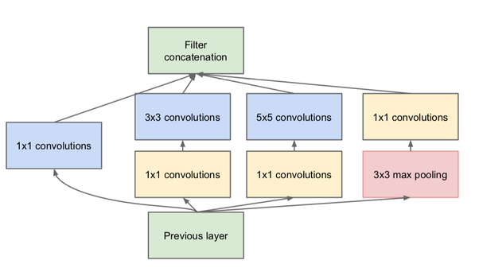
    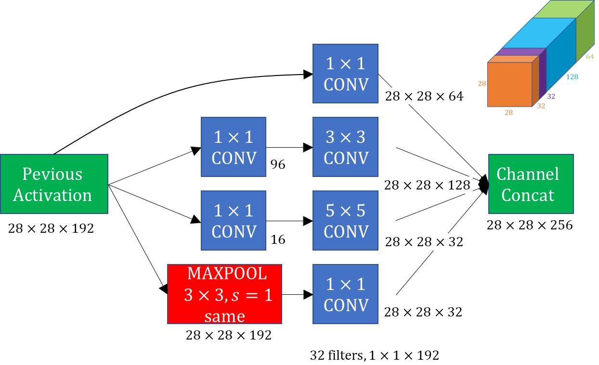
    - use of 1x1 convolution; generate feature along the depth and make one neuron.
    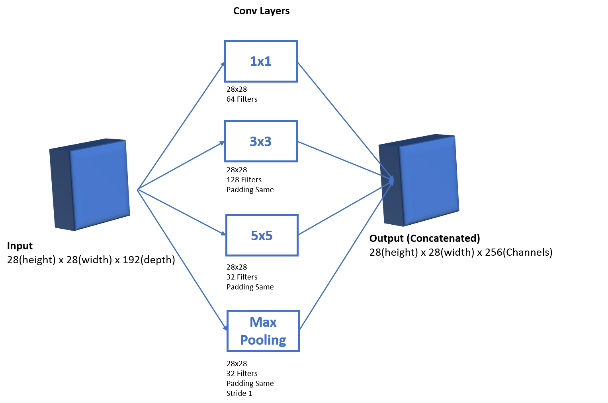
    ```python
      def inception_module(layer_in, f1, f2_in, f2_out, f3_in, f3_out, f4_out):
    # 1x1 conv
    conv1 = Conv2D(f1, (1,1), padding='same', activation='relu')(layer_in)
    # 3x3 conv
    conv3 = Conv2D(f2_in, (1,1), padding='same', activation='relu')(layer_in)
    conv3 = Conv2D(f2_out, (3,3), padding='same', activation='relu')(conv3)
    # 5x5 conv
    conv5 = Conv2D(f3_in, (1,1), padding='same', activation='relu')(layer_in)
    conv5 = Conv2D(f3_out, (5,5), padding='same', activation='relu')(conv5)
    # 3x3 max pooling
    pool = MaxPooling2D((3,3), strides=(1,1), padding='same')(layer_in)
    pool = Conv2D(f4_out, (1,1), padding='same', activation='relu')(pool)
    # concatenate filters, assumes filters/channels last
    layer_out = concatenate([conv1, conv3, conv5, pool], axis=-1)
    return layer_out
      ```
  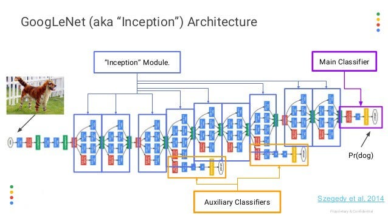
  ### 2. Resnet:
    difference between Alexnet vs VGG
      + Alexnet ---> bigger filter, lower depth
      + VGG     ---> lower filter, bigger depth
      there is usecase of bigger filter or usecase fo bigger depth

### Q. If image embedding architecture is Alexnet, vgg, rasnet and inception then what is transfer learning 
Transfer learning is a machine learning technique where a model trained on one task is reused or adapted for a different but related task. In the context of image embedding using architectures like AlexNet, VGG, ResNet, and Inception, transfer learning involves taking a pre-trained model (trained on a large dataset, typically for image classification tasks) and fine-tuning it on a smaller dataset for a specific task, such as image embedding.

Instead of training the entire model from scratch, which requires a large amount of labeled data and computational resources, transfer learning allows leveraging the knowledge captured by the pre-trained model. By fine-tuning only the final layers or a subset of layers, the model can be adapted to extract features relevant to the new task, such as generating image embeddings. This approach often leads to faster convergence and better performance, especially when the target dataset is small or similar to the dataset used for pre-training.
# CNN for Medical Diagnosis
Talk about another architecture that is little more efficient(meaning less number of parameters). and can be deployed on portable device lets says on a smartphone. - __Mobile Net__

```python
import tensorflow as tf
#import all necessary layers
from tensorflow.keras.layers import Input, DepthwiseConv2D
from tensorflow.keras.layers import Conv2D, BatchNormalization
from tensorflow.keras.layers import ReLU, AvgPool2D, Flatten, Dense
from tensorflow.keras import Model
```

```python
# MobileNet block
def mobilnet_block (x, filters, strides):
    x = DepthwiseConv2D(kernel_size = 3, strides = strides, padding = 'same')(x)
    x = BatchNormalization()(x)
    x = ReLU()(x)

    x = Conv2D(filters = filters, kernel_size = 1, strides = 1)(x)
    x = BatchNormalization()(x)
    x = ReLU()(x)

    return x
```

```python
#stem of the model
input = Input(shape = (224, 224, 3))
x = Conv2D(filters = 32, kernel_size = 3, strides = 2, padding = 'same')(input)
x = BatchNormalization()(x)
x = ReLU()(x)
# main part of the model
x = mobilnet_block(x, filters = 64, strides = 1)
x = mobilnet_block(x, filters = 128, strides = 2)
x = mobilnet_block(x, filters = 128, strides = 1)
x = mobilnet_block(x, filters = 256, strides = 2)
x = mobilnet_block(x, filters = 256, strides = 1)
x = mobilnet_block(x, filters = 512, strides = 2)
for _ in range (5):
     x = mobilnet_block(x, filters = 512, strides = 1)
x = mobilnet_block(x, filters = 1024, strides = 2)
x = mobilnet_block(x, filters = 1024, strides = 1)
x = AvgPool2D (pool_size = 7, strides = 1, data_format='channels_first')(x)
output = Dense (units = 1000, activation = 'softmax')(x)
model = Model(inputs=input, outputs=output)
model.summary()
```

# Object Localisation and Detection
LINK 1: https://colab.research.google.com/drive/1MTvGvZPDhYaHhf3fkCyfgyFpaHqqAQO1#scrollTo=5z6gO9LFMfsh
``` 
+ till now we have seen the simple things, we have an object and we need to classify the class of the image or we need to find the image similarity amount the images. in this topic we are going to se some adavance topic like how to locate and detect any image.
+ example: Detection and track the gun man in public place, to prevent some denger.
```

## __Problem Statement__:
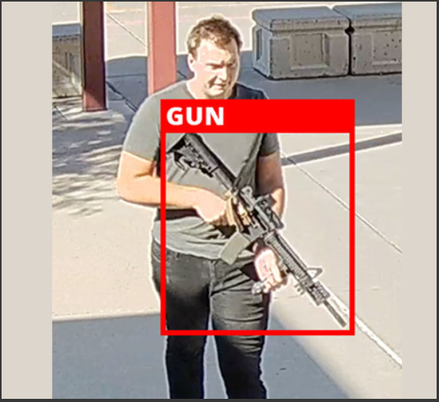


```
With increasing number of mass shooting incidents at schools, Malls and other public places across US, there is a need of always on and effective Monitoring systems that can identify potential dangers and alert beforehand.

Law enforcement agencies that guard public places currently rely on technology like walk-through or handheld magnetometers, which detect changes in local magnetic fields.

You are working as a Machine Learning Engineer at Omnilert AI.

Your team is planning to create an AI-powered visual gun detection System that can identify threats and immediately trigger multi-channel alerts and automated pre-defined safety protocols.

You are given the responsibility of developing ML powered system that can be used to connet with existing video surveillance cameras to reliably and rapidly recognize firearms.

```

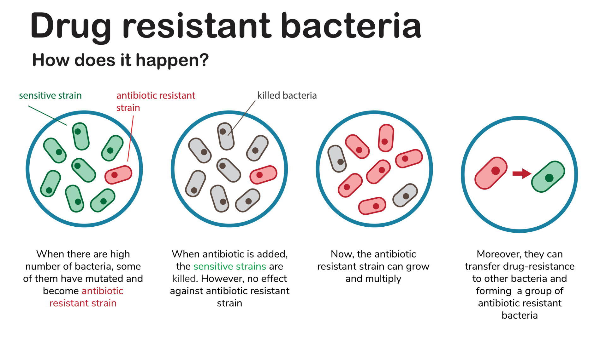

```
With the increasing prevalence of antibiotic-resistant bacteria and the need for rapid diagnosis and treatment of infectious diseases, there is a demand for advanced diagnostic tools that can quickly identify pathogens and guide appropriate treatment.

Medical professionals currently rely on traditional methods such as culturing bacteria from patient samples, which can be time-consuming and delay treatment initiation.

As a Bioinformatics Research Scientist at GenoMedics Inc., your team is developing an AI-powered pathogen detection system that can rapidly analyze genomic data from patient samples to identify bacterial and viral pathogens with high accuracy.

You are tasked with creating machine learning algorithms that can efficiently process genomic sequences and classify them into known pathogens or potential novel threats, enabling healthcare providers to make informed treatment decisions in real-time.

The system will integrate seamlessly with existing laboratory equipment and electronic medical records, providing clinicians with actionable insights within minutes of sample collection.

```

# Object detection & localisations
+ In this process, we are not only locating multiple object but also find the location of the object in real-time and put bounding box on multiple object.
+ for example: in self driving car, we are not only trying to detect only road but also we are trying to detect the trafic light, we are try to detect the pradistrian, other car, tree etc, we are trying to detect and identify multiple object in my vision and also the location of the object.
+ we can not solve this using previous method, because in that method we are focusing in the single object, like car, bike, tree, etc.
+ in previous method we can only say that if car(let take) present in my image or not. 
+ our game is over, the moment we flatten our image, using global max pooling. we lost our information and we focus only on the single object.
+ output dimension is not fixed. it could be anything, location is lost.

```
Model will cover
1. RCNN
2. Fast RCNN + Faster RCNN
3. YELO-v3, v5
```

```
Today we'll see:
1. How training data look like. and get preparied
2. Model(RCNN)
3. Inferences
```

```
Whenever we are trying to solve object detection and localization problem, first thing we need to do is anotations.
Given an image, we have a task to solve car, person and tree.
These 3 are my object of interest that a business had told me. obiously we are saying object detection and localization of multiple object, this doesn't means we have to consider all object in the universe. we still have to define these are my object of interest.
```
### 1. (Anotations) Preparation of Training Data
- let's say we have collected 1000 images. and in each on the image we have search the object.
- Given the image we have to detect the image and draw a bounding box around the object.
- for that we need __anotation tool__, we have to draw a bounding box.
class, Top left(bx, by), right bottom(bh, bw).
- Best Anotation Tool is __RoboFlow__.
- One Bounding box can not contain multiple object, 1 bounding box only contain single object. boundary must be well define.
- This is true that during anotation, there are
 chances prople do mistake that we need to handle.
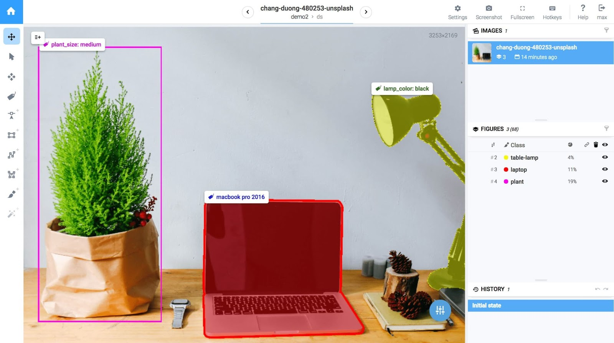
- it generate the train, test and validate data with label like coco, yelo etc. different archiceture need to differernt label for example YOLO-v3 need coco and YOLO-v5 take yolo json etc.

```
+ Given a image and anotation(class, & bounding box) find a relationship between after training with anotation.
+ in the prediction we have to predict where is my bounding box corrdinate.
+ in this case our class is not just label, it is label and certain cordinates.
+ Bounding box has to be predicted. we need to learn bounding box through image and label.
+ we have to provide the -ve image also. like man holding stick, or empty hand.
```
#### How it map the image and bounding box?
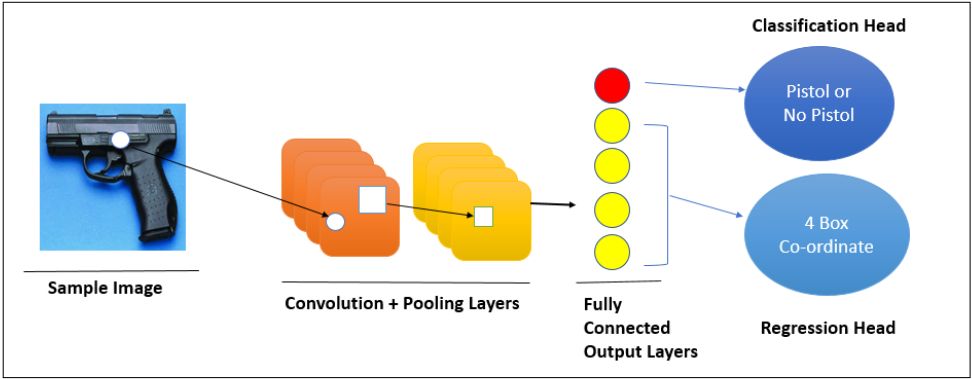
```
+ we have image we (convoluate and max pooling)xN because it is good at finding the feature of the image. 
+ and fully connected layer has 5 neurons. 1 neuron is for classification head and 4 neurons is box-Coordinate. 
+ this is only possible if we have one object in an image. & that is what we are solving here right now.
+ we have image, class label & bounding box coordinate, please learn it and predict the bounding box.
```

### 2. (Model) Implement object detection using Resnet
+ Resnet we use not trainable
+ put code here

### 3. Predict and Evaluate
let say this image
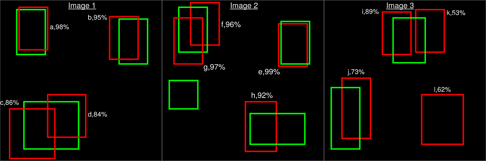
- in image1 let's say green is our actural bounding box and red is predicted bounding box, now the question is that how well i did predict.
- Here, __IOU(intersection over union)__ is define: what is esscial mean is that if there is box number 1 and there is box number 2, what we define in interection over union is the common area in the both of the boxes.

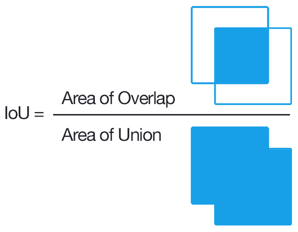
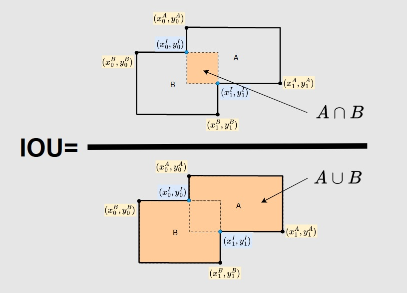

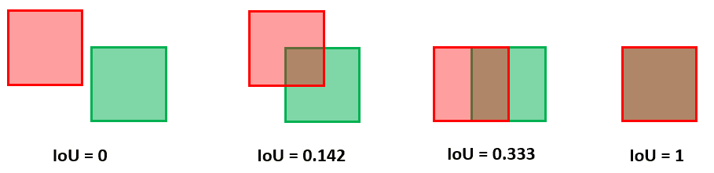

<div style="display: flex;">
    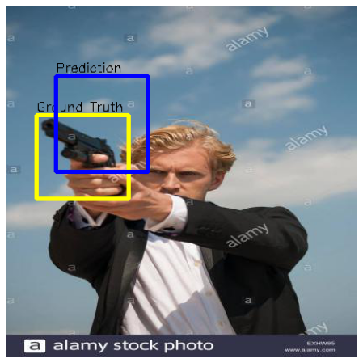
    
</div>


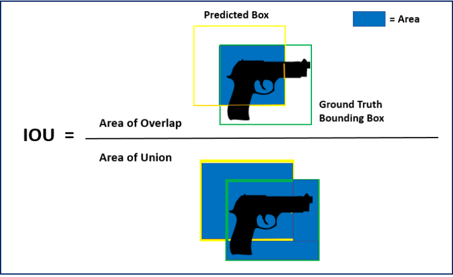

Q. How do we measure wheather the ground truth and the prediction are similar?
```
1. IOU(intersection over union)
```

Q. How do we now extend this model to multi-object in a image.

1. Bruteforce approch:
```
Step 1: we have one image which contain multiple image.
Step 2: we take random crops from that particular image(small size crop small size not very big size).
Step 3: We resize the random crop to same size.
Step 4: and i Pass it through two different convoluation and predictor, One which is trained on the watch(model 1) and another which is trained on the pistol(model 2). trying to find out the class and the 4 bounding box. whoever got the heightest probabiliy choose that.
Step 5: now, for each of the crop we have either watch or postol and there bounding box, and then i know the crop position of all bouding box crop. put all the bounding box on the image.
Step 6: Do some clean up and your pistol and watch will detection.
clean up process: NON MAX SUPRESSION
```
Disadvantage of Bruteforce Approch:
0. Independent Detector: This is not efficient, because for differnt object we have to create different model and train it.
1. We have to create differnt convoluton for differnt object.
2. multiple crops: we have lot of crop to predict. 
3. random crop: crops must have some logic it should not be random.

### RCNN and FastRCNN Process
```
RCNN and FastRCNN works on this principal, the only difference how RCNN generate this crop and fastRCNN generate this crop.
```
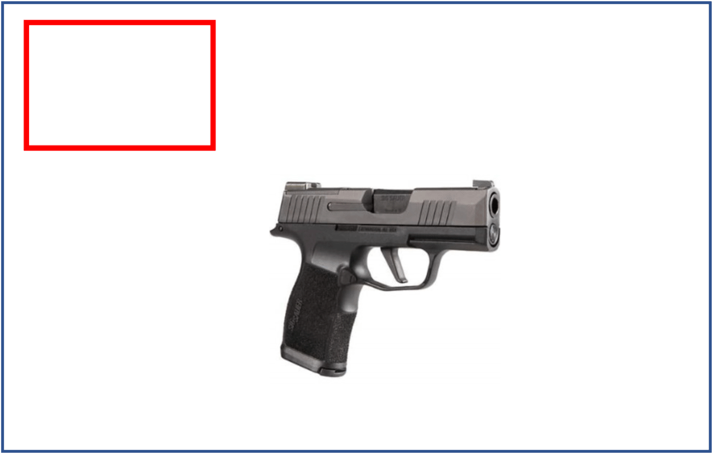

> Remember the Objective, We have multiple object in multiple image, we want to predict the object in an image and also locate the object in an image.

### RCNN
- take 40-50 second for 1 image, not benfit in real time project
- RCNN says that given an image first you perform __selective search Alogorithm and generate region proposal__
- clustring of similar pixel

### FastRCNN 
- `advance and take less time to process`
- `in fast RCNN region proposal is comming from selective search algorithm.`
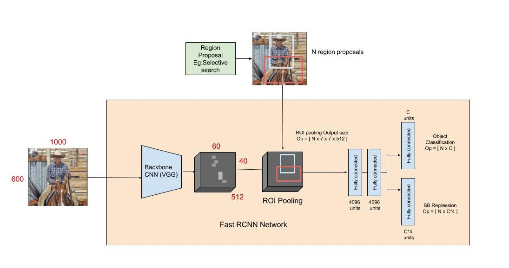

### FasterRCNN
- `More advance then Fast, takes differnt approch then it family`
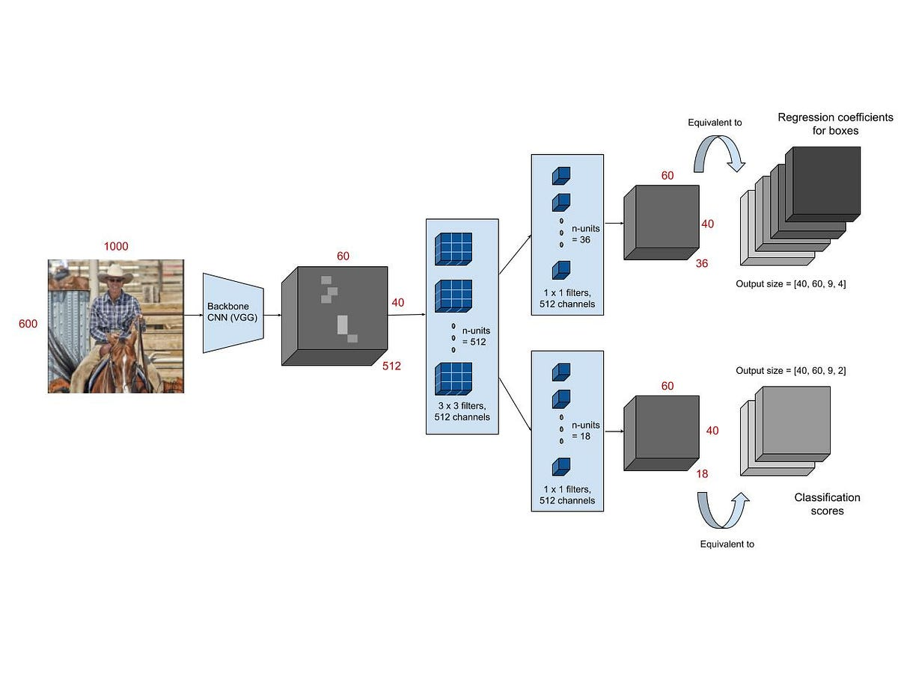
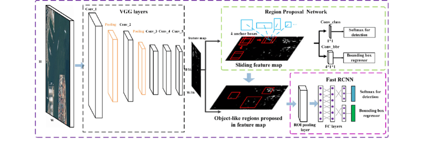

### difference between RCNN vs FastRCNN vs FasterRCNN
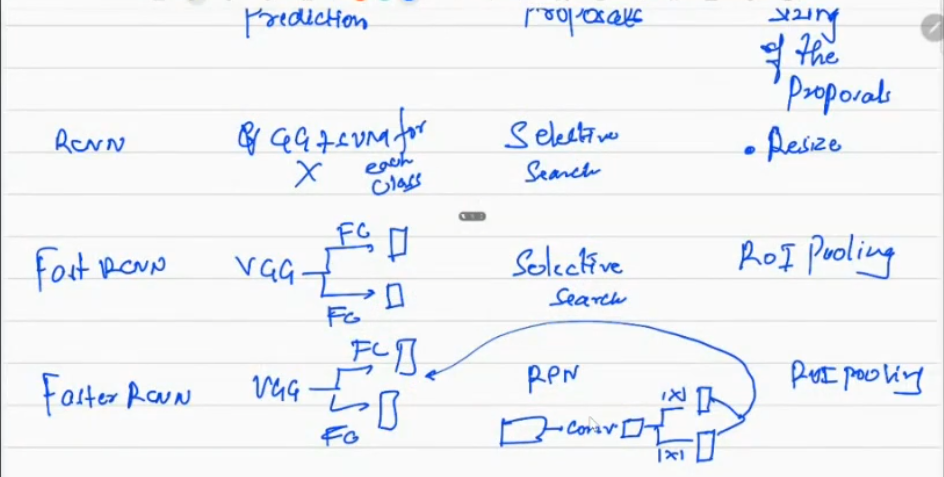

### YELO(You Only Looks Once )
- much faster then FasterRCNN
- You only live onecs
- version v3, v4, v5, v8 etc

#### YELO loss function
if class is available
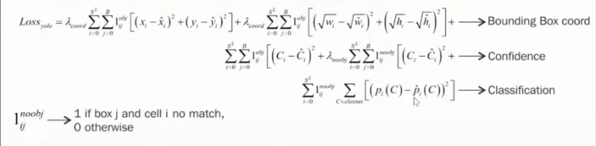

if class is not avaiable
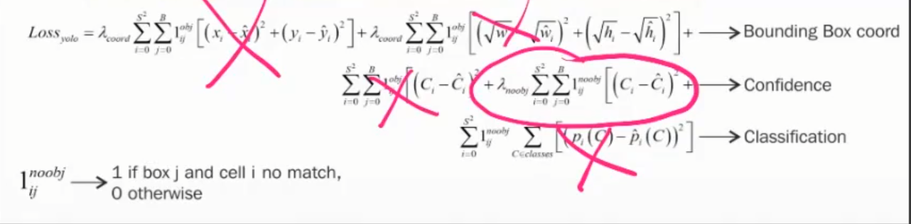

#### Problem with selective search Alogorithm
- There is high chances our selective search algorithm capture only half part of the object and rest half of the object take care by another search algorithm.
* `Clean Up process`: so we have to do some kind of clean up process. 
* car - for each class get me the box with the highest car probability keep it and all box which have a IOU > 0.7 with the above have delete them.
* tree - heighest probability all tree IOU > 0.7
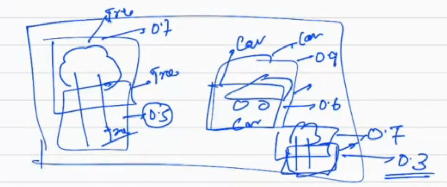

`note: For each class, pick up the highest probability box fot that class remove the boxes which also predict the same class if they have IOU > 07.` <br>
`And repeat the process do it until you all predicted classes is finish and do it for next class.`

Q. Suppose I have tree-1 and tree-2, both are far away from each other, will IOU of t1 w.r.t t2 be high or low? <br>
`A. Ofcouse low`


# Object Segmentation
Given an image i wanted to detect at pixel level what class it belongs to?


